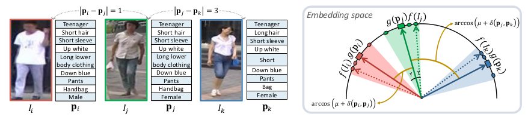
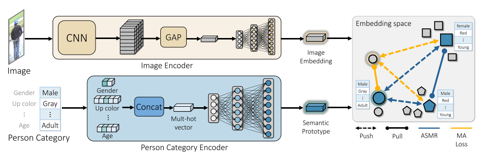

# ASMR: Learning Attribute-Based Person Search with Adaptive Semantic Margin Regularizer
This repository is official implementation of "[ASMR: Learning Attribute-Based Person Search with Adaptive Semantic Margin Regularizer](https://openaccess.thecvf.com/content/ICCV2021/papers/Jeong_ASMR_Learning_Attribute-Based_Person_Search_With_Adaptive_Semantic_Margin_Regularizer_ICCV_2021_paper.pdf)" (ICCV 2021).




## Overall architecture


## Requirements 
*  Python == 3.7.7
*  Pytorch == 1.6.0

## Installation
```bash
git clone https://github.com/BoseungJeong/ASMR.git
cd ASMR
conda env create -f ASMR.yaml
conda activate ASMR
```

## Download data
Market-1501: Download original [Market-1501 dataset](https://www.cv-foundation.org/openaccess/content_iccv_2015/papers/Zheng_Scalable_Person_Re-Identification_ICCV_2015_paper.pdf) and its [attribute dataset](https://arxiv.org/abs/1703.07220). 

## Pre-processing data
After downloading Market-1501, the pre-processing is required to run our model by following:
```bash
python prepare_Market.py
python prepare_Market_Attribute.py
```

## GPU information
* NVIDIA Titan XP


## Training and Evaluation
After installing requirements and downloading datasets, you can run our model by following:
* Pre-training with attribute recognition
```bash
python train_AR.py --AR --train_all --lr 0.01 --batchsize 64 --num_epoch 40
```

* Train and evaluation on Market-1501
```bash
sh Train_and_Test_ASMR_Market.sh
```

## Citation
If you find ASMR useful in your work, you can cite our paper:
```python
@InProceedings{Jeong_2021_ICCV,
author    = {Jeong, Boseung and Park, Jicheol and Kwak, Suha},
title     = {ASMR: Learning Attribute-Based Person Search With Adaptive Semantic Margin Regularizer},
booktitle = {Proceedings of the IEEE/CVF International Conference on Computer Vision (ICCV)},
month     = {October},
year      = {2021},
pages     = {12016-12025}
}
```
